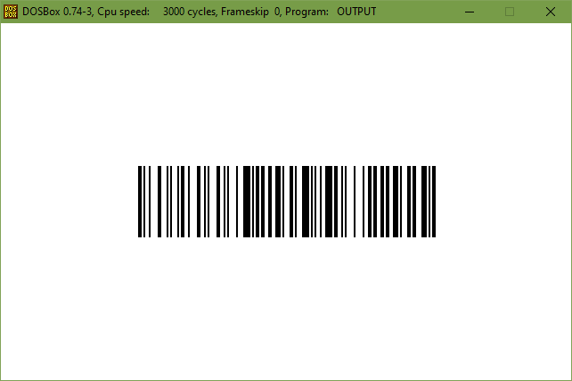

# Code128

Intel 8086 application written in assembly language. Converts a message to its graphical
representation as Code128B.

## Prerequisites
- You need a machine with Windows.
- The compiler (Microsoft Macro Assembler v6.13.7299) is already included in the repository and
  should run on any Windows version.
- You need to have DOSBox (https://www.dosbox.com/).
- DOSBox must be installed in the standard path `C:\Program Files (x86)` or its directory must be
  added to the PATH environment variable.
- You need to have Python3. It must be reachable directly via `python` command (so the Python
  directory must be added to the PATH environment variable). Otherwise you cannot use automatic
  `compile.bat` and `run.bat` scripts.

## Running the application
Firstly run `compile.bat` script. If the compilation is successful you get following message on the
standard output:

    Microsoft (R) Macro Assembler Version 6.13.7299
    Copyright (C) Microsoft Corp 1981-1997.  All rights reserved.
    Assembling: <path-to-the-repository>\src\main.asm
    Microsoft (R) Segmented Executable Linker  Version 5.60.339 Dec  5 1994
    Copyright (C) Microsoft Corp 1984-1993.  All rights reserved.
    Object Modules [.obj]: main.obj
    Run File [main.exe]: "output.exe"
    List File [nul.map]: NUL
    Libraries [.lib]:
    Definitions File [nul.def]:

Compilation output files are put under `build` directory. Now you can run `run.bat` script and pass
the message you want to convert to Code128B via command line arguments:

    run.bat Hello World!

DOSBox should run and you'll get your code:

Now you can test the code with any QR/barcode app on your smartphone.

Press ESC and then use `exit` command to exit DOSBox.
